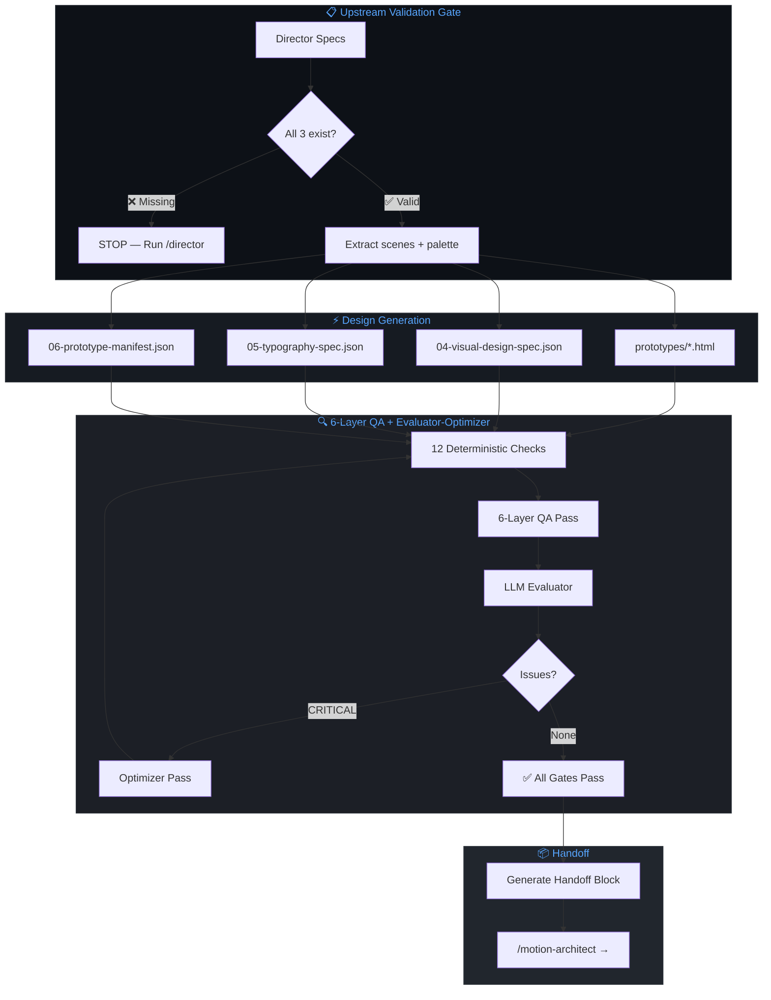
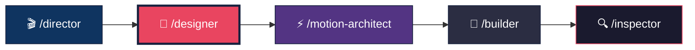

<p align="center">
  <h1 align="center">🎨 The Designer</h1>
  <p align="center">
    <strong>World-class visual design specification agent for video pipelines</strong>
  </p>
  <p align="center">
    <a href="#architecture"></a>
    <a href="#contracts"></a>
    <a href="LICENSE"></a>
    <a href="#tests"></a>
    <a href="#"></a>
    <a href="#"></a>
  </p>
</p>

---

**The Designer** is Agent 2 in a multi-agent video production pipeline. It transforms the Director's locked specs into **frozen visual frames** — HTML prototypes + machine-readable JSON design specifications. Every frame must work as a poster before it moves.

> *"If the design doesn't work as a still frame, motion won't save it. A poster that can't communicate in 2 seconds doesn't deserve to move."*

This is not a prompt document. It is a **production-grade agent** with 11 Pydantic-enforced contracts, WCAG color science, a 6-layer QA pipeline, and native Claude Agent SDK integration. Every artifact is type-checked, contrast-validated, and canvas-scaled before it can leave the agent.

---

## ✨ What Makes This Different

| Dimension | Basic Prompt Agent | **The Designer** |
|-----------|-------------------|-----------------|
| Color validation | "Please use accessible colors" | `contrast_ratio()` — WCAG 2.1 AA enforcement at model level |
| Canvas scaling | "Remember to multiply by 3" | `@model_validator` raises on any `canvas ≠ prototype × 3` |
| Design contracts | JSON templates | 11 Pydantic models — `ValidationError` at generation time |
| Typography | "Use a type scale" | Weight contrast ≥300 enforced, min font sizes per role |
| Validation | Manual review | `DesignValidator` — 12 deterministic checks + LLM evaluator |
| Error recovery | None | `_optimizer_pass()` re-runs with failure context |
| Depth layers | "Add some depth" | ≥2 layers per scene enforced, z-index ordering validated |
| Element tracking | DOM inspection | Every element: `data-element-id`, `data-layer`, geometry registered |
| SDK integration | Generic assistant | Native `.claude/commands/`, `CLAUDE.md`, async streaming |
| System prompt | Markdown headers | XML-structured ACI (Agent-Computer Interface) |

---

## 🏗️ Architecture

<a name="architecture"></a>



---

## 🚀 Quick Start

### Installation

```bash
# Clone the repo
git clone https://github.com/sufianmypa1203-oss/the-designer.git
cd the-designer

# Install dependencies
pip install -e ".[dev]"
```

### Usage

```bash
# Start design from upstream specs
/designer

# Validate existing design artifacts only
/designer --validate-only
```

### Programmatic Usage

```python
import asyncio
from designer import DesignerAgent

async def main():
    agent = DesignerAgent.from_upstream("specs/", project_id="subscription-creep")
    async for chunk in agent.run():
        print(chunk, end="", flush=True)

asyncio.run(main())
```

### Validate WCAG Contrast

```python
from designer import contrast_ratio, check_wcag_aa

# Check if white text on dark background is accessible
ratio = contrast_ratio("#FFFFFF", "#0A0A12")
print(f"Contrast ratio: {ratio}:1")  # 19.54:1 ✅

# Boolean check
assert check_wcag_aa("#FFFFFF", "#0A0A12")  # True ✅
assert not check_wcag_aa("#CCCCCC", "#FFFFFF")  # False ❌ — too low
```

### Validate a Design Spec

```python
import json
from designer import VisualDesignSpec

with open("specs/04-visual-design-spec.json") as f:
    data = json.load(f)

# This will raise ValidationError if anything is wrong
spec = VisualDesignSpec(**data)
print(f"✅ Valid: {len(spec.scenes)} scenes")
```

### Canvas Scaling Enforcement

```python
from designer import TextElement

# This PASSES ✅ — canvas = prototype × 3
text = TextElement(
    element_id="scene-1-hero-text-0",
    role="hero",
    text_content="Your money disappears",
    type_scale_token="hero",
    font_size_prototype=32,
    font_size_canvas=96,           # 32 × 3 = 96 ✅
    font_weight=900,
    font_family_token="sans",
    letter_spacing="-0.04em",
    color="#FFFFFF",
    animation_intent="character-stagger",
)

# This FAILS ❌ — wrong canvas scaling
TextElement(
    # ... same as above but:
    font_size_prototype=32,
    font_size_canvas=90,           # Should be 96! ValidationError raised
)
```

### JSON Schema Export

```python
from designer.tools import export_schemas

result = export_schemas("schemas/")
# Creates:
#   schemas/visual-design-spec.schema.json
#   schemas/typography-spec.schema.json
#   schemas/prototype-manifest.schema.json
```

---

## <a name="contracts"></a> 📐 Contract System

The Designer enforces **compile-time guarantees** on all visual design artifacts via 11 Pydantic models.

### What Gets Validated

| Contract | Validates | On Failure |
|----------|-----------|------------|
| `ColorApplication` | 60-30-10 split, hex format, WCAG contrast ≥4.5:1 | `ValidationError` |
| `FocalPointSpec` | ONE focal element, isolation technique, eye path | `ValidationError` |
| `DepthLayer` | z-index ≥0, opacity 0-1, blur values | `ValidationError` |
| `SceneDesignSpec` | Color + focal + depth consistency, ≥2 layers | `ValidationError` |
| `VisualDesignSpec` | Unique scene IDs, PascalCase comp name, scene-map cross-ref | `ValidationError` |
| `TextElement` | Canvas = prototype × 3, min font sizes per role, tracking rules | `ValidationError` |
| `SceneTypography` | Weight contrast ≥300, type ramp | `ValidationError` |
| `TypographySpec` | Unique scene IDs, font families | `ValidationError` |
| `ElementGeometry` | All 4 coordinates × 3, semantic role | `ValidationError` |
| `PrototypeEntry` | Element count matches, unique IDs per prototype | `ValidationError` |
| `PrototypeManifest` | Total element count, globally unique IDs, version | `ValidationError` |

### Font Size Minimums (1080×1920 Canvas)

| Role | Minimum | Prototype (÷3) |
|------|---------|----------------|
| Hero | 96px | 32px |
| Counter | 150px | 50px |
| Sub | 72px | 24px |
| Label | 36px | 12px |
| Caption | 27px | 9px |
| Badge | 24px | 8px |

---

## 🔍 Evaluator-Optimizer Loop

After generating all design artifacts, a **separate validation pass** runs:

1. **Upstream** — Director artifacts exist and are schema-valid
2. **Schema** — All 3 specs pass Pydantic validation
3. **Cross-reference** — Scene IDs match across scene-map and all specs
4. **Color** — 60-30-10 applied, ≤3 colors per scene
5. **Contrast** — WCAG AA ≥4.5:1 for all text elements
6. **Canvas** — Every measurement = prototype × 3
7. **Depth** — ≥2 layers per scene
8. **Focal** — Not a logo in hook scenes
9. **Elements** — Globally unique IDs across all prototypes
10. **Prototype coverage** — One HTML per scene
11. **6-Layer QA** — Concept, Typography, Color, Space, Emotion, Craft
12. **LLM Evaluator** — Semantic visual quality check

```python
from designer import DesignValidator

validator = DesignValidator(specs_dir="specs/")
issues = validator.run_all_deterministic()
print(validator.format_report(issues))
# ✅ All design validations passed. Artifacts are clean.
```

---

## 🎨 6-Layer QA Pass

| Layer | What It Checks |
|-------|---------------|
| **1. Concept** | Communicates in 2s? ONE metaphor? ONE entry point? |
| **2. Typography** | Golden ratio ramp? Weight contrast ≥300? Hero ≤7 words? |
| **3. Color** | 60-30-10 named? Focal isolated? Grayscale test? ≤3 colors? |
| **4. Space** | ≥1 relief zone? 20% extra white space? Z/F eye pattern? |
| **5. Emotion** | Target emotion mapped? Color temp matches? Shape psychology? |
| **6. Craft** | Every element earns its place? Thumbnail test? Decoratives serve focal? |

---

## 📁 Project Structure

```
the-designer/
├── README.md                          ← You are here
├── AGENT.md                           ← Architecture documentation
├── CLAUDE.md                          ← Agent persistent memory (SDK native)
├── CONTRIBUTING.md                    ← How to contribute
├── LICENSE                            ← MIT License
├── pyproject.toml                     ← Python packaging + dependencies
├── .gitignore
│
├── .claude/
│   └── commands/
│       └── designer.md                ← /designer slash command
│
├── src/
│   └── designer/
│       ├── __init__.py                ← Package exports (all 11 models + utils)
│       ├── agent.py                   ← DesignerAgent class (async SDK loop)
│       ├── models.py                  ← Pydantic contracts (THE source of truth)
│       ├── validator.py               ← DesignValidator (12 checks + LLM evaluator)
│       ├── tools.py                   ← ACI-engineered tools (8 tools)
│       ├── prompts.py                 ← System prompt (XML-structured)
│       └── color_utils.py             ← WCAG contrast calculator, hex parser
│
├── knowledge/
│   ├── color_theory.md                ← 60-30-10, WCAG, color psychology
│   ├── visual_psychology.md           ← Gestalt, attention, visual hierarchy
│   ├── layout_composition.md          ← Grids, white space, canvas scaling
│   ├── cinematic_video_layout.md      ← Vertical video zones, focal isolation
│   ├── design_laws.md                 ← Hick's, Fitts's, Von Restorff, Golden Ratio
│   └── design_qa.md                   ← 6-layer QA checklist
│
├── tests/
│   ├── test_models.py                 ← 36 contract validation tests
│   ├── test_color_utils.py            ← 22 WCAG contrast tests
│   ├── test_validator.py              ← 11 QA pass tests
│   └── test_cross_validation.py       ← 10 upstream + tool tests
│
└── specs/                             ← Designer output (auto-created at runtime)
```

---

## 🧪 <a name="tests"></a> Testing

```bash
# Run all tests
python -m pytest tests/ -v

# Run with coverage
python -m pytest tests/ -v --cov=src/designer

# Run a specific test class
python -m pytest tests/test_models.py::TestTextElement -v

# Run color utility tests only
python -m pytest tests/test_color_utils.py -v
```

### What's Tested (80 Tests)

- ✅ Canvas scaling ×3 enforcement (mismatch → `ValidationError`)
- ✅ WCAG AA contrast ratio calculation (black/white = 21:1)
- ✅ Hex color parsing (#RGB and #RRGGBB)
- ✅ 60-30-10 color application validation
- ✅ Weight contrast ≥300 enforcement
- ✅ Minimum font sizes per role (hero ≥96px, caption ≥27px)
- ✅ All-caps label tracking ≥0.35em
- ✅ ≥2 depth layers per scene
- ✅ Focal element exists in depth layers
- ✅ Scene ID consistency across nested models
- ✅ Element count matches actual elements
- ✅ Globally unique element IDs across prototypes
- ✅ Duplicate scene ID detection
- ✅ PascalCase composition name enforcement
- ✅ Upstream artifact existence checks
- ✅ Prototype filename pattern validation
- ✅ `data-element-id` and `data-layer` attribute checks
- ✅ JSON Schema export integrity
- ✅ Handoff blocking on critical issues
- ✅ Validation report formatting

---

## 🔗 Pipeline Position

The Designer is **Agent 2 of 5** in the video production pipeline:



| Agent | Responsibility | Reads | Produces |
|-------|---------------|-------|----------|
| `/director` | Intake, brief, script, scene-map | User input | `01-brief.md`, `02-script.md`, `03-scene-map.json` |
| **`/designer`** ← You are here | Visual design, HTML prototypes, design specs | All 3 Director specs | `04-visual-design-spec.json`, `05-typography-spec.json`, `06-prototype-manifest.json`, `prototypes/*.html` |
| `/motion-architect` | Motion physics, springs, easing | All upstream specs | Motion spec with spring constants |
| `/builder` | `.tsx` code, Remotion composition | All upstream specs | Final production code |
| `/inspector` | Quality audit against all specs | All artifacts + output | Audit report + pass/fail |

---

## 🎯 Hard Rules (Contract-Enforced)

These aren't suggestions. They're enforced by Pydantic validators that raise `ValidationError`:

| Rule | Enforcement |
|------|-------------|
| Canvas scaling = prototype × 3 | `TextElement.validate_canvas_scaling()`, `ElementGeometry.validate_canvas_coordinates()` |
| WCAG AA contrast ≥4.5:1 | `ColorApplication.validate_contrast_ratios()` |
| ≥2 depth layers per scene | `SceneDesignSpec.depth_layers` min_length=2 |
| Weight contrast ≥300 | `SceneTypography.validate_weight_contrast()` |
| 60-30-10 color split | `ColorApplication` model — exactly 3 named colors |
| Element count matches | `PrototypeEntry.validate_element_count()` |
| Globally unique element IDs | `PrototypeManifest.validate_globally_unique_element_ids()` |
| Focal element in depth layers | `SceneDesignSpec.validate_focal_element_in_layers()` |
| PascalCase composition names | `VisualDesignSpec.composition_name` pattern |
| All-caps tracking ≥0.35em | `TextElement.validate_label_tracking()` |
| Hero font ≥96px canvas | `TextElement.validate_minimum_canvas_size()` |
| Scene ID consistency | `SceneDesignSpec.validate_scene_id_consistency()` |

---

## 🧠 Design Philosophy

This agent is built on **three principles**:

1. **Design is communication architecture** — Every pixel choice must answer "why?" If the design doesn't work as a still frame, motion won't save it.
2. **Type-safety is the design system** — Pydantic contracts ARE the design rules. You can't ship a broken design because it won't compile.
3. **Deep ACI investment** — XML-structured prompts, tool descriptions that match how Claude uses tools, error messages that tell the agent exactly what to fix.

---

## 📄 License

[MIT](LICENSE) — Use it, fork it, improve it.

---

## 🤝 Contributing

See [CONTRIBUTING.md](CONTRIBUTING.md) for guidelines.

---

<p align="center">
  <sub>Built with the <a href="https://github.com/sufianmypa1203-oss/my-agents-and-skill">Elite Factory Hub</a> — World-Class Agent Architecture</sub>
</p>
